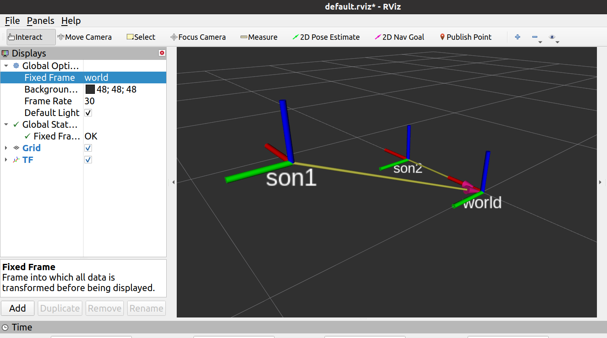


    案例描述:现有坐标系统，父级坐标系统 world,下有两子级系统 son1，son2，son1 相对于 world，以及 son2 相对于 world 的关系是已知的，求 son1原点在 son2中的坐标，又已知在 son1中一点的坐标，要求求出该点在 son2 中的坐标.已知son1和son2相对于world的偏移量分别是(0.2 0.8 0.3 0 0 0)和(0.5 0 0 0 0 0)

<!-- more -->

**案例分析:**

1. 首先，需要发布 son1 相对于 world，以及 son2 相对于 world 的坐标消息
2. 然后，需要订阅坐标发布消息，并取出订阅的消息，借助于 tf2 实现 son1 和 son2 的转换
3. 最后，还要实现坐标点的转换

**前提:**发布两个子坐标系节点(也是静态坐标节点)

```xml
<launch>
    <node pkg="tf2_ros" name="son1" type="static_transform_publisher" args="0.2 0.8 0.3 0 0 0 /world /son1" output="screen" />
    <node pkg="tf2_ros" name="son2" type="static_transform_publisher" args="0.5 0 0 0 0 0 /world /son2" output="screen" />
</launch>
```



