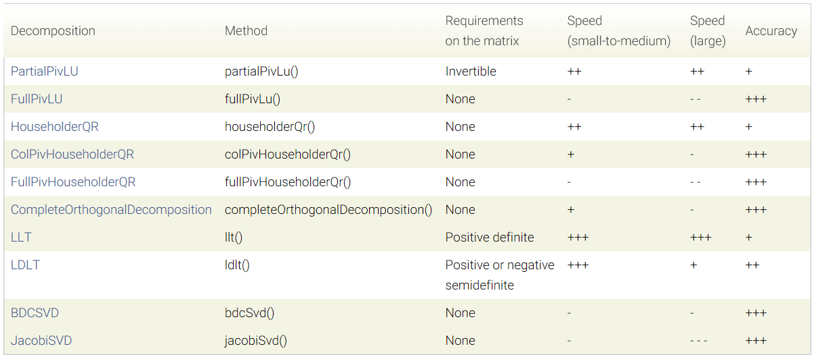



Eigen是一个 C++ 开源线性代数库。它提供了快速的有关矩阵的线性代数运算，还包括解方程等功能。许多上层的软件库也使用 Eigen 进行矩阵运算，包括 g2o、Sophus 等。



<!-- more -->

官方文档：https://eigen.tuxfamily.org/dox/

## 主函数

```c++
#include <iostream>
using namespace std;
#include <ctime>
// Eigen 部分
#include <Eigen/Core>
// 稠密矩阵的代数运算（逆，特征值等）
#include <Eigen/Dense>

#define MATRIX_SIZE 50

/****************************
 * 本程序演示了 Eigen 基本类型的使用
 ****************************/

int main(int argc, char **argv)
{
    // Eigen 中所有向量和矩阵都是Eigen::Matrix，它是一个模板类。它的前三个参数为：数据类型，行，列
    // 声明一个2*3的float矩阵
    Eigen::Matrix<float, 2, 3> matrix_23;

    // 同时，Eigen 通过 typedef 提供了许多内置类型，不过底层仍是Eigen::Matrix
    // 例如 Vector3d 实质上是 Eigen::Matrix<double, 3, 1>，即三维向量
    Eigen::Vector3d v_3d;
    // 这是一样的
    Eigen::Matrix<float, 3, 1> vd_3d;

    // Matrix3d 实质上是 Eigen::Matrix<double, 3, 3>
    Eigen::Matrix3d matrix_33 = Eigen::Matrix3d::Zero(); //初始化为零
    // 如果不确定矩阵大小，可以使用动态大小的矩阵
    Eigen::Matrix<double, Eigen::Dynamic, Eigen::Dynamic> matrix_dynamic;
    // 更简单的
    Eigen::MatrixXd matrix_x;
    // 这种类型还有很多，我们不一一列举

    // 下面是对Eigen阵的操作
    // 输入数据（初始化）
    matrix_23 << 1, 2, 3, 4, 5, 6;
    // 输出
    cout << matrix_23 << endl;

    // 用()访问矩阵中的元素
    for (int i = 0; i < 2; i++)
    {
        for (int j = 0; j < 3; j++)
            cout << matrix_23(i, j) << "\t";
        cout << endl;
    }

    // 矩阵和向量相乘（实际上仍是矩阵和矩阵）
    v_3d << 3, 2, 1;
    vd_3d << 4, 5, 6;
    // 但是在Eigen里你不能混合两种不同类型的矩阵，像这样是错的
    // Eigen::Matrix<double, 2, 1> result_wrong_type = matrix_23 * v_3d;
    // 应该显式转换
    Eigen::Matrix<double, 2, 1> result = matrix_23.cast<double>() * v_3d;
    cout << result << endl;

    Eigen::Matrix<float, 2, 1> result2 = matrix_23 * vd_3d;
    cout << result2 << endl;

    // 同样你不能搞错矩阵的维度
    // 试着取消下面的注释，看看Eigen会报什么错
    // Eigen::Matrix<double, 2, 3> result_wrong_dimension = matrix_23.cast<double>() * v_3d;

    // 一些矩阵运算
    // 四则运算就不演示了，直接用+-*/即可。
    matrix_33 = Eigen::Matrix3d::Random(); // 随机数矩阵
    cout << matrix_33 << endl
         << endl;

    cout << matrix_33.transpose() << endl;   // 转置
    cout << matrix_33.sum() << endl;         // 各元素和
    cout << matrix_33.trace() << endl;       // 迹
    cout << 10 * matrix_33 << endl;          // 数乘
    cout << matrix_33.inverse() << endl;     // 逆
    cout << matrix_33.determinant() << endl; // 行列式

    return 0;
}
```

## CMakeLists.txt

```cmake
cmake_minimum_required( VERSION 2.8 )
project( useEigen )

set( CMAKE_BUILD_TYPE "Release" )
set( CMAKE_CXX_FLAGS "-O3" )

# 添加Eigen头文件
include_directories( "/usr/include/eigen3" )
# 添加可执行文件
add_executable( eigenMatrix eigenMatrix.cpp )
```

## 运行

```bash
mkdir build
cd build 
cmake ..
make -j4
./eigenMatrix
```

结果

```bash
1 2 3
4 5 6
1       2       3
4       5       6
10
28
32
77
 0.680375   0.59688 -0.329554
-0.211234  0.823295  0.536459
 0.566198 -0.604897 -0.444451

 0.680375 -0.211234  0.566198
  0.59688  0.823295 -0.604897
-0.329554  0.536459 -0.444451
1.61307
1.05922
 6.80375   5.9688 -3.29554
-2.11234  8.23295  5.36459
 5.66198 -6.04897 -4.44451
-0.198521   2.22739    2.8357
  1.00605 -0.555135  -1.41603
 -1.62213   3.59308   3.28973
0.208598
Eigen values = 
0.0242899
 0.992154
  1.80558
Eigen vectors = 
-0.549013 -0.735943  0.396198
 0.253452 -0.598296 -0.760134
-0.796459  0.316906 -0.514998
time use in normal inverse is 0.682ms
time use in Qr decomposition is 0.363ms
```

## 矩阵分解

##### (1)LU三角分解

三角分解法是仅对方阵有效，将原方阵分解成一个上三角形矩阵或是排列(permuted)的**上三角形矩阵**和一个**下三角形矩阵**，这样的分解法又称为LU分解法。它的用途主要在简化一个大矩阵的行列式值的计算过程、求反矩阵和求解联立方程组。不过要注意这种分解法所得到的上下三角形矩阵并非唯一，还可找到数个不同的一对上下三角形矩阵，此两三角形矩阵相乘也会得到原矩阵。`[L,U]=lu(A)`

##### (2)QR分解

QR分解法对象不一定是方阵，其将矩阵分解成一个**正规正交矩**阵与上**三角形矩阵**,所以称为QR分解法,与此正规正交矩阵的通用符号Q有关。`[Q,R]=qr(A)`

##### (3)SVD分解

奇异值分解(singular value decomposition,SVD)是另一种正交矩阵分解法；SVD是最可靠的分解法，但是它比QR分解法要花上近十倍的计算时间。`[U,S,V]=svd(A)`，其中U和V分别代表两个正交矩阵，而S代表一对角矩阵。和QR分解法相同，原矩阵A不必为方阵。使用SVD分解法的用途是解最小平方误差法和数据压缩。

##### (4)LLT分解

又称Cholesky分解，其把一个对称正定的矩阵表示成一个**下三角矩阵L**和**其转置**的乘积的分解。它要求矩阵为方阵，且所有特征值必须大于零，故分解的下三角的对角元也是大于零的(LU三角分解法的变形)。$A=LL^T$

##### (5)LDLT分解

LDLT分解法实际上是Cholesky分解法的改进，因为Cholesky分解法虽然不需要选主元，但其运算过程中涉及到开方问题，而LDLT分解法则避免了这一问题，可用于求解线性方程组。 也需要分解对象为方阵，分解结果为$A=LDL^T$。其中L为一下三角形单位矩阵(即主对角线元素皆为1)，D为一对角矩阵(只在主对角线上有元素，其余皆为零)，$L^T$为L的转置矩阵。

## 求解方程组

### 求解特征向量与特征值

```cpp
#include <Eigen/Core>
#include <Eigen/Dense>
#include <iostream>
using namespace std;

int main(int argc, char const *argv[])
{
    cout << "*******求解矩阵的特征向量和特征值*******" << endl;
    // 实对称矩阵可以保证对角化成功,但是也要考虑无法对角化的情况
    Eigen::Matrix2f A;
    A << 1,2,3,4;
    Eigen::EigenSolver<Eigen::Matrix2f> eigensolver(A);
    if (eigensolver.info() == Eigen::Success)
    {
        cout << "特征值：" << endl << eigensolver.eigenvalues() << endl;
        cout << "特征向量：" << endl << eigensolver.eigenvectors() << endl;
    }else
    {
        cout << "矩阵不可以对角化" << endl;
    }
    return 0;
}
```

### 求解线性方程组

线代中形如`Ax=b`的线性方程组是最简单的入门示例。对于常规适定的线性方程组(未知数个数=方程个数)，可以采用常规的矩阵分解法求解。在Eigen中有多种解法可供选择，以满足在精度与效率上不同的需求。有如下方程组：
$$
\left\{
\begin{aligned}
1x_1 + 2x_2+3x_3 & =  3 \\
4x_1 + 5x_2+6x_3 & =  3 \\
7x_1 + 8x_2+10x_3 & =  4
\end{aligned}
\right.
$$

```cpp
#include <Eigen/Core>
#include <Eigen/Dense>
#include <iostream>
#include <ctime>
using namespace std;

int main(int argc, char const *argv[])
{
    cout << "*******求解线性方程组*******" << endl;
    Eigen::Matrix3f A1;
    Eigen::Vector3f b;
    A1 << 1, 2, 3, 4, 5, 6, 7, 8, 10;
    b << 3, 3, 4;

    clock_t time_stt = clock();
    Eigen::Vector3f x;

    cout << "QR分解" << endl;
    cout << A1.colPivHouseholderQr().solve(b) << endl; // QR分解
    cout << "总计用时：" << 1000 * (clock() - time_stt) / (double)CLOCKS_PER_SEC << "ms" << endl; 
    return 0;
}

```

上述代码调用了`.colPivHouseholderQr()`函数对方程进行求解。Eigen中所有不同方法调用都有固定的格式：`x = A.methodName().solve(b)`，如下是Eigen中一些常用方法的比较，根据需要选择不同方法。



Eigen还可以解一些长的比较“奇怪”的方程组(如x、b并不是向量而是矩阵)，如下方程组：
$$
\left( \begin{matrix} 
2  & -1 \\
-1 & 3
\end{matrix}\right)
\left( \begin{matrix} 
x_1 & x_2 \\
x_3 & x_4
\end{matrix}\right)
=
\left( \begin{matrix} 
1 & 2 \\
3 & 1
\end{matrix}\right)
$$

```cpp
#include <Eigen/Core>
#include <Eigen/Dense>
#include <iostream>
#include <ctime>
using namespace std;
int main(){
	 Eigen::Matrix2f A0, b0;
    A0 << 2, -1, -1, 3;
    b0 << 1, 2, 3, 1;
    clock_t time_stt0 = clock();

    cout << "LDLT分解" << endl;
    cout << A0.ldlt().solve(b0) << endl;
    cout << "总计用时：" << 1000 * (clock() - time_stt0) / (double)CLOCKS_PER_SEC << "ms" << endl;

}
```

